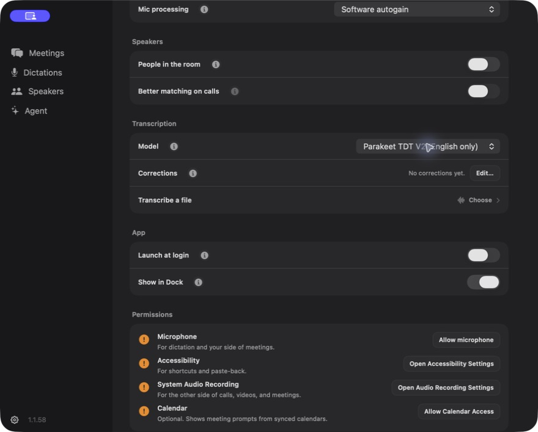

# Parakeet v2 contribution workpad

## Scope and ownership

Add an opt-in English-only Parakeet TDT v2 model through the existing shared
selector. Parakeet v3 remains the default, both Whisper choices remain available,
and unknown stored preferences retain their existing fallback.

This is one model capability, not a general Speech refactor. Support owns the
persisted identity/cache metadata; Speech owns the runtime. Meetings continue
to use `MeetingSTTAdapter` and the existing router. No Core library, capture
device, permission, entitlement, telemetry payload, release, or update changes.

The lifecycle changes are necessary because v2 and v3 share one engine: selection
must not unload active inference or let canceled native loads overlap. Concrete
foreground leases defer selection until the last user releases the runtime;
generation checks reject stale callbacks; successor initialization waits for
canceled work and cleanup to drain. Existing lifecycle states remain canonical.

## Compatibility and model provenance

- Uses the existing pinned FluidAudio 0.15.4 model distribution and v2 API;
  no new model host, dependency, checksum bypass, or entitlement.
- V2 requires its own compiled joint model and vocabulary. Supported canonical
  and compatible legacy v2 caches are preserved; migration refuses symlinks,
  merging, and overwriting an existing destination.
- Cache completeness, migration, coexistence, and re-download eligibility are
  fixture-tested; personal caches were not deleted for testing.
- Saved v2 artifacts use `parakeet_v2_local`; v3 keeps `parakeet_local` and its
  existing footer. Capture-format docs, reader smoke coverage, and the QA engine
  allowlist recognize the new value without weakening unknown-engine rejection.

## Automated proof

Implementation tested at `2c6e2bc1`, against upstream base
`792d82e159b2f5546e2b474d4a3100a4fe6fa442`, on Apple Silicon with Xcode 26.6
and Metal Toolchain 17F109. Subsequent evidence-only files do not change runtime.

- `python3 scripts/dev/agent-context.py --base <base>`: owner/matrix routing checked.
- `bash scripts/dev/agent-preflight.sh`: pass.
- `bash build-deps.sh --force`: pass, including Metal shaders.
- `bash build.sh --no-open`: pass, including isolated launch and bundle budget.
- `bash run-tests.sh`: 12,746 assertions pass.
- `bash run-integration-smoke.sh`: pass, including 45 production-lifecycle
  executor assertions and seven recovery-merge tests.
- `python3 scripts/dev/check-build-source-lists.py`: pass.
- `bash run-e2e-smoke.sh`: pass.
- `bash -n run-integration-smoke.sh` and its canonical entrypoint: pass.
- `swift test --package-path Tools/TranscriptedQA`: 67 tests pass.
- Additional Core package proof: 1,079 tests, 13 existing skips, zero failures.
- `bash scripts/ops/transcripted-qa-bench.sh --mode full --strict-artifacts`:
  15/15 pass, exit 0. Final post-GUI artifact validation: 94 pass, zero fail,
  seven warnings (absent dictations and optional capture-quality metadata).
- `TRANSCRIPTED_RUNTIME_BUDGET=1 bash build.sh --no-open`: exit 0; bundle 88.5 MiB,
  launch-to-interactive 937 ms against 3000 ms. **No live dictation samples:**
  latency/RTF percentiles are unavailable, not measured passing values. The
  ambient log spans earlier runs and long idle intervals; it is not a controlled
  model-load benchmark.

The lifecycle harness compiles the actual production executor against delayed
fake dependencies and scaffold engine state. It covers joining, supersession,
late callbacks, retries/watchdog, active-use admission and cleanup ordering.
It is not hardware, real-engine activity-callback, or full-router proof by itself.

## Actual app checks

- Selected v2 in Settings; verified English-only copy and all four picker options.
- Downloaded/prepared each real model and imported the same local synthetic
  English fixture through the native picker. All four saved expected text with
  their correct concrete engine identifiers.
- Switched back to cached v2 and observed Ready. Relaunch preserved selection.
- During a 48:33 repeated-synthetic v2 import, selected v3. The saved job stayed
  v2; logs show v3 initialization only after the job finished and cleaned up.
- Exact-dependency cached v2/v3 inference also passed with process networking
  denied. A network-denied full-app run was not separately performed.

Screenshot captured from the actual development app on 2026-09-07. It contains
only Settings, no transcript text, identities, paths or private user content.
The permission warnings are real: this ad-hoc build did not consistently retain
or recognize grants. They do not imply a live-capture pass.

## Limitations and review notes

- Live microphone-dependent dictation, meeting/overlap and hardware paste-back
  checks were explicitly skipped at the contributor's request: no input device
  is connected. Bluetooth/AirPods/Zoom behavior is not claimed.
- No representative accented-English quality study; the motivation is not a
  claim that v2 improves accuracy for all accents.
- Whisper Turbo's first cold import did not finish while model preparation
  exceeded the existing wait budget. Retrying after Ready passed. This is
  disclosed, not asserted to be a v2 regression or silently treated as a pass.
- Earlier independent full-base and incremental reviews found no outstanding
  must-fix. Rejected review suggestion: delete legacy v2 cache unconditionally.
  Historical FluidAudio 0.7.9 inspection showed it already used the compatible
  modern layout, so guarded migration/preservation is safer than data deletion.
- Keep the PR draft until human review. No related issue currently exists;
  this branch-local workpad supplies the agent-workpad context without inventing
  an issue or publishing one on the contributor's behalf.
